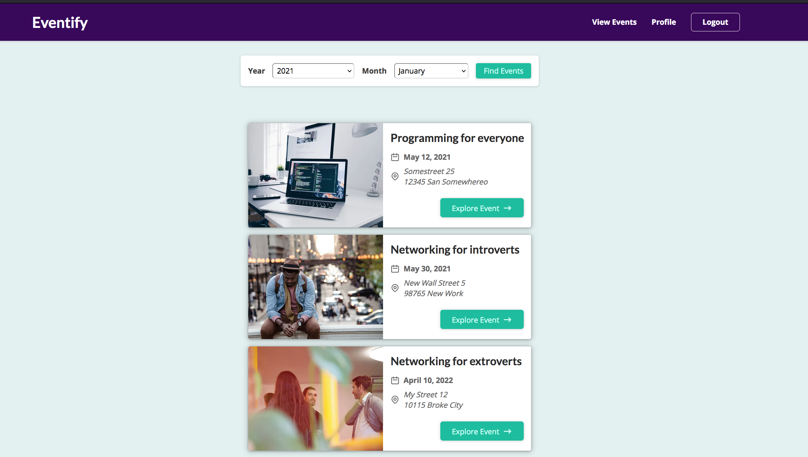

### Eventify App

App is live on https://eventify-app.vercel.app

NextJS React Application implemented with Typescript and some server side rendering

---

<div align="center">
  <br>
</div>

---

First install dependencies:

```bash
npm install
# or
yarn install
```

Then run the development server:

```bash
npm run dev
# or
yarn dev
```

Open [http://localhost:3000](http://localhost:3000) with your browser to see the result.

You'll need the API service to run app fully

Visit the API repo, you can clone and install dependencies then run the app on localhost

https://github.com/DavyCode/eventify-api

#or

Simply use the following base api

https://eventify-api.herokuapp.com

#Things to improve on th project

- Wire up test
- Update user profile
- Events are currently static data, you can tryout your backend skills with the API repo
- Add a way for users to comment
- Extra - Add rating for events, users can rate their favorite events
- Make something awesome i guess ;)

#Learn More About NextJS

To learn more about Next.js, take a look at the following resources:

- [Next.js Documentation](https://nextjs.org/docs) - learn about Next.js features and API.
- [Learn Next.js](https://nextjs.org/learn) - an interactive Next.js tutorial.
